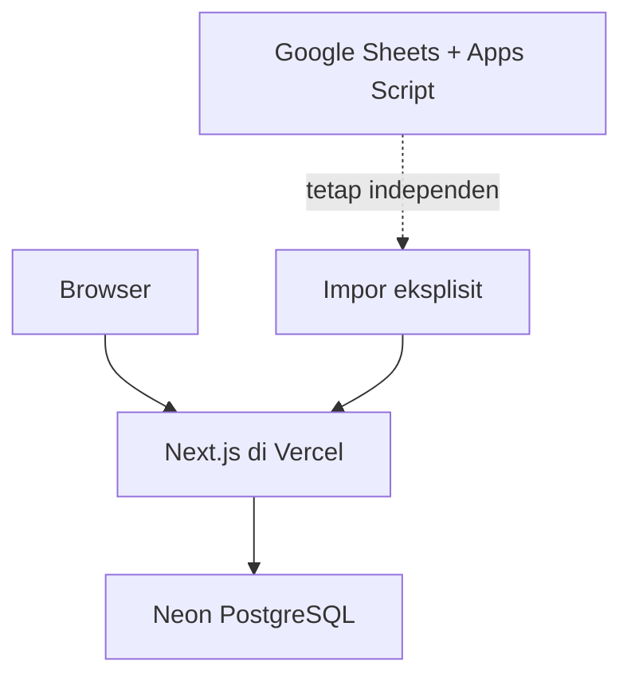

# Architecture

## 1. Prinsip

- Modular monolith untuk mengurangi kompleksitas operasi.
- PostgreSQL sebagai sumber kebenaran aplikasi baru.
- Relasional untuk identitas, akses, status, dan hubungan inti; JSONB untuk definisi blok, jawaban, dan rubrik fleksibel.
- Server-side authorization pada setiap operasi data.
- Aplikasi Apps Script terpisah tanpa sinkronisasi.
- Preferensi pada layanan gratis atau biaya rendah selama tetap aman dan dapat dipelihara.

## 2. Stack

- Next.js App Router dengan TypeScript.
- Neon PostgreSQL.
- Drizzle ORM dan migration.
- Zod untuk schema validation.
- Vercel untuk preview dan deployment produksi.

Pemilihan library autentikasi, komponen UI, dan test runner ditetapkan dalam rencana implementasi setelah kompatibilitas versi diperiksa. Kontrak keamanan pada dokumen ini tetap berlaku apa pun library yang dipilih.

## 3. Topologi



Tidak ada request runtime dari aplikasi lama ke Neon atau sebaliknya. File spreadsheet hanya dibaca pada proses impor yang dipicu admin.

## 4. Modul aplikasi

| Modul | Tanggung jawab |
|---|---|
| `auth` | Login, sesi, reset kredensial, role dan session version |
| `academics` | Periode, kelas, murid, enrollment, dan penugasan guru |
| `learning` | Pertemuan, item belajar, versi konten, indikator, publikasi |
| `submissions` | Draft, autosave, submit, versi, batas revisi |
| `assistance` | Permintaan bantuan dan visibilitas draft sementara |
| `assessment` | Rubrik, komentar, nilai, tindak lanjut |
| `attendance` | Kehadiran per pertemuan |
| `journals` | Fakta, observasi, refleksi, tindak lanjut |
| `audit` | Perubahan penting dan penelusuran kejadian |
| `import` | Validasi, pratinjau, dan impor idempotent |

Modul boleh berbagi database, tetapi aturan bisnis hanya diakses melalui service/domain function modul terkait. UI tidak menulis langsung ke tabel.

## 5. Struktur rute awal

```text
/login
/murid
/murid/belajar/[meetingId]
/murid/tugas/[activityId]
/murid/riwayat
/guru
/guru/kelas/[classId]
/guru/aktivitas/[activityId]/builder
/guru/aktivitas/[activityId]/review
/admin
/admin/periode
/admin/kelas
/admin/pengguna
/admin/impor
/admin/audit
/version
```

## 6. Model data fase pertama

### Identitas dan akademik

1. `users` — identitas, role, credential guru/admin, status, session version.
2. `students` — profil murid, kode, nomor absen, dan PIN hash.
3. `academic_periods` — tahun ajaran, semester, status aktif/arsip.
4. `classes` — kelas dalam satu periode.
5. `class_enrollments` — keanggotaan murid pada kelas.
6. `teacher_class_assignments` — akses guru terhadap kelas.

### Konten pembelajaran

7. `meetings` — pertemuan, jadwal, dan status akses.
8. `learning_items` — materi, latihan, resume, refleksi, LKPD, atau asesmen.
9. `learning_item_versions` — versi isi, schema blok JSONB, dan rubrik JSONB.
10. `learning_outcomes` — tujuan pembelajaran dan indikator.
11. `learning_item_outcomes` — relasi item dengan outcome.
12. `student_activity_settings` — override tenggat, dispensasi, dan tambahan revisi.

### Pekerjaan dan penilaian

13. `submissions` — draft aktif dan status per murid/item.
14. `submission_versions` — snapshot immutable jawaban terkirim.
15. `help_requests` — permintaan bantuan dan masa visibilitas draft.
16. `comments` — komentar pada blok, versi, atau permintaan bantuan.
17. `reviews` — rubrik, nilai, keputusan, dan umpan balik per versi.
18. `attendance_records` — kehadiran per murid/pertemuan.

### Sistem

19. `journal_entries` — fakta, observasi, refleksi, dan tindak lanjut.
20. `audit_logs` — perubahan penting tanpa isi jawaban lengkap.

### Constraint penting

- Satu `submissions` per pasangan murid dan item.
- `submission_versions` unik pada submission dan nomor versi.
- Versi terkirim tidak di-update; koreksi menghasilkan versi baru atau review baru sesuai jenis perubahan.
- Hanya satu periode berstatus aktif.
- Nomor absen unik dalam satu kelas aktif.
- Review menunjuk satu submission version.
- Tambahan revisi disimpan sebagai override eksplisit dan diaudit.

## 7. Aliran data utama

### Autosave

1. Client mengirim jawaban, `lock_version`, dan timestamp lokal.
2. Server memeriksa sesi, kepemilikan, status aktivitas, dan schema jawaban.
3. Update hanya berhasil jika `lock_version` cocok.
4. Server menaikkan lock version dan mengembalikan waktu simpan.
5. Konflik tidak menimpa data; client menawarkan data lokal atau versi server.

### Submit

1. Client membuat idempotency key.
2. Server memvalidasi akses, tenggat, schema, dan batas versi.
3. Transaksi mengunci submission, membuat snapshot, memperbarui status, dan menulis audit.
4. Server mengembalikan receipt hanya setelah commit berhasil.

### Bantuan

1. Murid membuka help request.
2. Query guru boleh membaca draft hanya selama status request `OPEN` dan guru memiliki kelas.
3. Komentar menyimpan target blok dan penulis.
4. Penutupan request menghapus izin membaca draft aktif tanpa menghapus percakapan.

### Review

1. Guru memilih versi, default paling baru.
2. Server memverifikasi penugasan kelas.
3. Review menyimpan rubric score, nilai, keputusan, dan feedback pada versi tersebut.
4. Ringkasan submission dihitung dari review versi terbaru, bukan dengan menimpa riwayat.

## 8. Autentikasi dan keamanan

- Password dan PIN di-hash dengan `scrypt`, salt unik, dan pepper dari environment.
- Sesi memakai cookie `HttpOnly`, `Secure`, dan `SameSite`.
- `session_version` membatalkan sesi lama setelah reset kredensial.
- Percobaan login gagal dan lock sementara disimpan per akun.
- Pesan login tidak mengungkap keberadaan akun.
- Mutation memeriksa session, role, ownership/class assignment, input schema, dan origin.
- Security headers mencakup CSP, HSTS, frame protection, dan `nosniff`.
- URL bukti dibatasi ke HTTPS dan tidak dirender sebagai HTML bebas.
- Secret, token, credential, dan isi lengkap jawaban tidak masuk audit log.

## 9. Kegagalan dan konsistensi

- Draft tetap berada di state browser ketika request gagal; fase pertama bukan offline penuh.
- Retry memakai backoff dan tidak membuat submit ganda.
- Error user-facing memakai Bahasa Indonesia sederhana dan correlation ID.
- Operasi impor dan submit bersifat transaksional.
- Penghapusan permanen tidak tersedia pada fase pertama; gunakan status inactive/archive.
- Aktivitas atau versi yang sudah direferensikan tidak boleh dihapus.

## 10. Migrasi spreadsheet

| Sumber | Tujuan |
|---|---|
| `Konfigurasi` | periods, classes, dan environment yang relevan |
| `Murid` + `Akun_Demo` | users, students, enrollments; PIN di-hash ulang |
| `Roster_Import` | input staging sementara, bukan tabel permanen |
| `Pertemuan` | meetings dan learning items/versions |
| `Respons_LKPD` + `Riwayat_Respons` | submissions dan submission versions |
| `Umpan_Balik` | comments dan reviews |
| `Asesmen_Event` + `Asesmen_Item` | learning items/versions dan outcomes |
| `Asesmen_Peserta` | diturunkan dari enrollments; hanya override disimpan |
| `Respons_Asesmen` + `Hasil_Asesmen` | submissions, versions, dan reviews |
| `Kehadiran` | attendance records |
| `Jurnal` | journal entries |
| `Log_Perubahan` | audit terpilih; `draft_saved` massal tidak diimpor |

Sheet P5 ditahan untuk fase selanjutnya.

## 11. Deployment dan versioning

- Vercel Preview berasal dari `dev` atau feature branch.
- Live deployment berasal dari `produksi`.
- Database migration harus backward-compatible terhadap aplikasi yang sedang live.
- Release memakai SemVer dan Git tag.
- Rollback aplikasi memakai deployment sebelumnya; database dipulihkan dengan forward fix atau backup terverifikasi.
- Backup dilakukan sebelum impor besar dan release yang mengubah skema.
- `/version` dan footer menampilkan versi aplikasi serta commit singkat.

## 12. Pengujian

- Unit: permission policy, schema blok, tenggat, batas revisi, scoring.
- Integration: login, autosave, submit, bantuan, komentar, review, impor.
- Database: constraint, transaction, migration, isolasi kelas.
- End-to-end: flow murid, guru, dan admin.
- Accessibility: keyboard, focus, label, kontras.
- Deployment smoke: login, koneksi database, dan `/version`.

Flow keamanan dan konsistensi pada `product-spec.md` wajib menjadi test otomatis sebelum rilis produksi.
